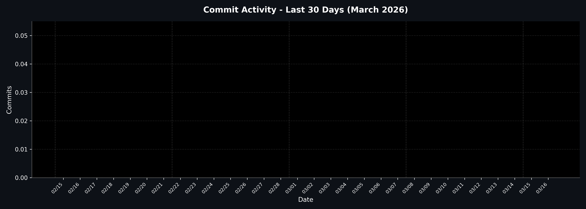

# DSA Learning Log

This repository contains my daily practice and learning notes for **Data Structures and Algorithms (DSA)**.

## Structure

- `Problems/` - Solved problems with code
- `Notes/` - Daily learning notes or concepts
- `Contests/` - Practice contest solutions

## How I use this repo

1. Solve a problem or learn a new concept.
2. Add the solution or note to the repo.
3. Commit and push daily to track progress.

## Goal

- Practice DSA consistently.
- Track daily progress with GitHub contributions.

---

<!-- STREAK:START -->
# 🔥 Work Streak Tracker

> Track your DSA learning consistency

**Current Streak:** 1 days  
**Total Commits (30d):** 15  
**Last Updated:** 2025-11-04

## 📊 30-Day Activity Chart

**Active days:** 7/30 • 
**Best day:** Oct 30 (5 commits) • 
**Avg/day:** 0.5

---

<!-- STREAK:END -->
